# 01-熟悉云平台和SBAS (SAP Business Application Studio)

SAP云平台(SAP Cloud Platform)是一个为智能企业构建的集成和扩展平台，它使得您能够连接您的环境并创建专注于您的业务需求的应用程序扩展。了解更多关于[SAP云平台](https://www.sap.com/sea/products/cloud-platform.html)。

SAP Business Application Studio (为使内容保持简短，接下来都会使用SBAS作为缩略语)是SAP的下一代开发工具，其内部集成了多种功能的插件，可以与SAP云平台以及其他产品无缝集成，SBAS内部也提供多种类型的模板，方便用户快速构建多种类型应用。

## 章节目标

在本章节中，您将完成以下内容：

- 申请试用账号
- SAP云平台中配置SBAS权限
- SAP云平台中通过订阅中心进入SBAS

## 登录云平台并配置SBAS权限

### 云平台试用账号申请

SAP云平台提供数据中心多样化的选择，您可以根据您的需要选择使用基于不同数据中心的SAP云平台环境，例如AWS, Google Cloud Platform，Microsoft Azure，Alibaba Cloud等。

在本次培训中，我们已经为您预先申请好了账号，请直接访问[SAP Cloud Platform on Alicloud](http://cockpit.cn40.platform.sapcloud.cn/cockpit)登录到SAP云平台主控室(基于阿里云环境)首页。

:point_right: 如果您希望申请SAP云平台基于AWS数据中心环境，您可以访问[云平台试用账号-基于AWS](https://cockpit.eu10.hana.ondemand.com/trial/#/home/trial)，您可以自由选择可选地理位置的数据中心创建该试用账号。

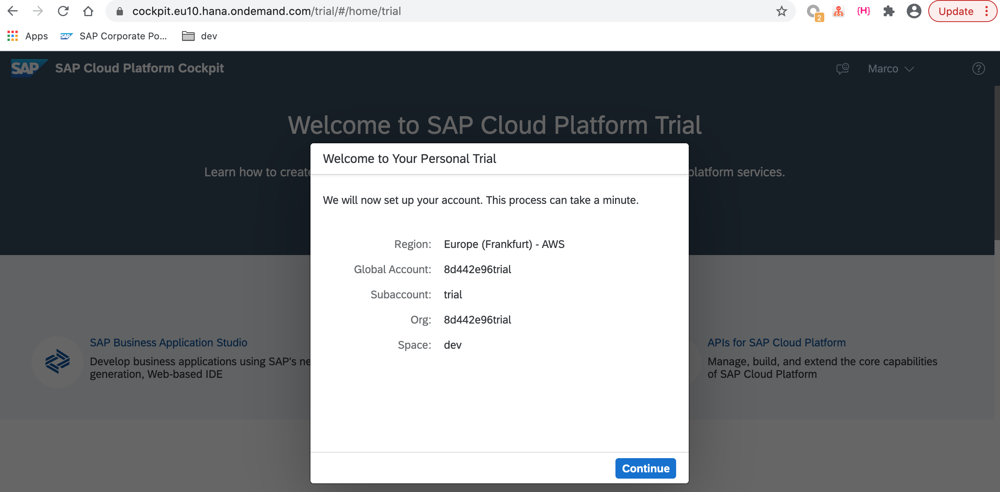

### 进入SAP云平台首页

针对于本次培训，请直接略过本小节内容直接进入下一小节[订阅SAP Business Application Studio](https://github.tools.sap/sap-samples-scpcn/teched-2020-12-15/blob/dev/exercises/01/README.md#%E8%AE%A2%E9%98%85sap-business-application-studio)。

试用账号申请完成之后，点击`Continue`进入SAP云平台试用账号首页。

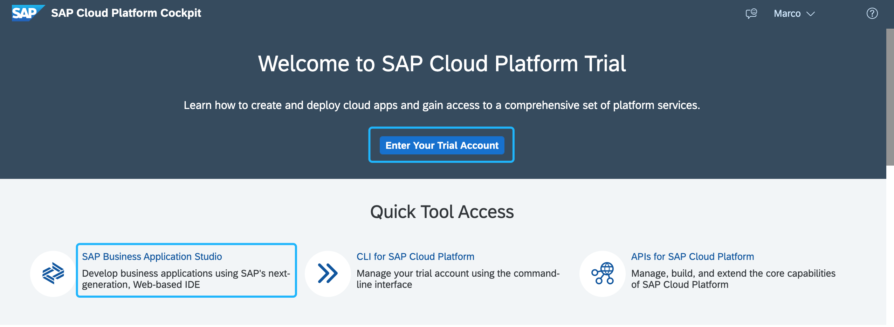

:point_right: 分别点击`Enter Your Trial Account`进入云平台主控室。点击`SAP Business Application Studio`进入SBAS首页。**请保持SBAS页面不要关闭**，留待后面使用。

云平台主页中显示默认为您分配了一个名称为trial的试用全局账号，点击trial面板访问该主账号。

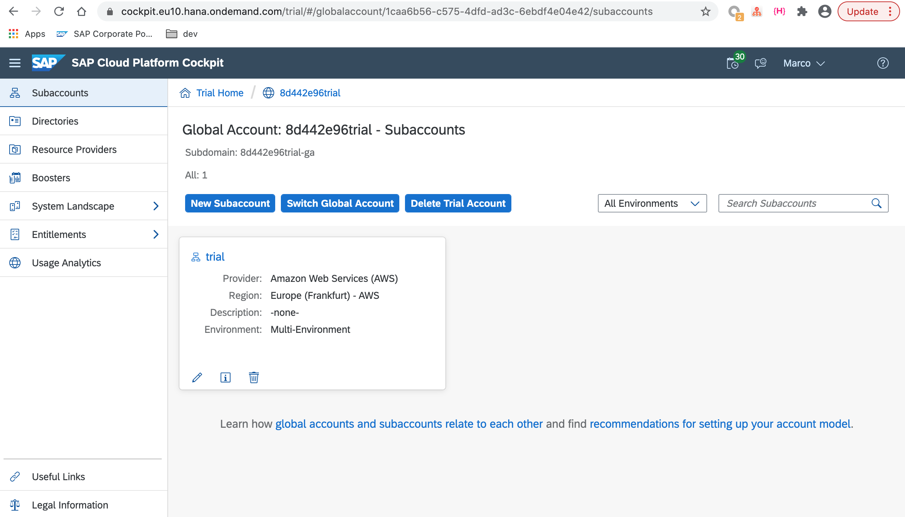

### 订阅SAP Business Application Studio

登录到SAP云平台主控室之后，默认情况下您将会看到您的账号已默认被委派了一个云平台全局账号，在该全局账号下存在一个名为`trial`的子账号。点击该trial子账号，在左侧`subscription`栏，您将会看到该子账户下已订阅的应用信息。

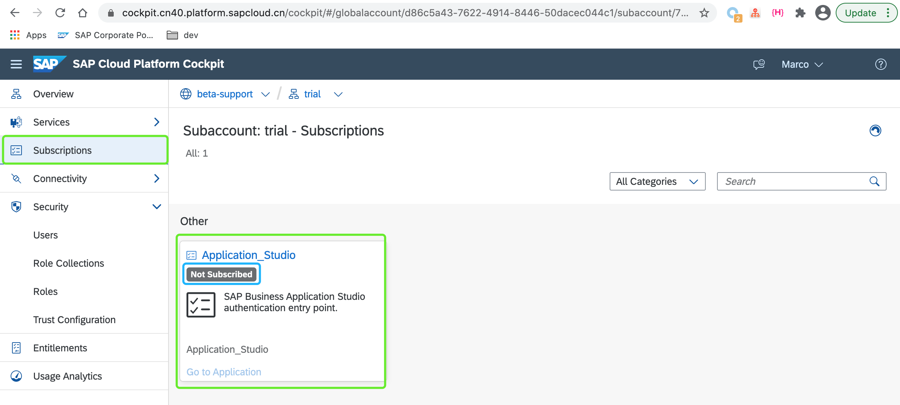

如上图所示，我们已默认为您的子账户分配了使用SAP Business Application Studio的配额。当前该应用订阅面板显示状态为`Not Subscribed`，同时`Go to Application`链接为灰色，表示您需要手动订阅SBAS(SAP Business Application Studio)之后才可以访问它。

:point_right: 点击SBAS面板，在如下所示页面中点击`Subscribe`按钮订阅SBAS。

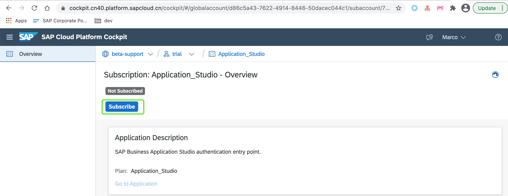

点击按钮之后，应用订阅状态会刷新，同时链接`Go to Application`将会被激活。表示现在您已成功订阅SBAS应用。

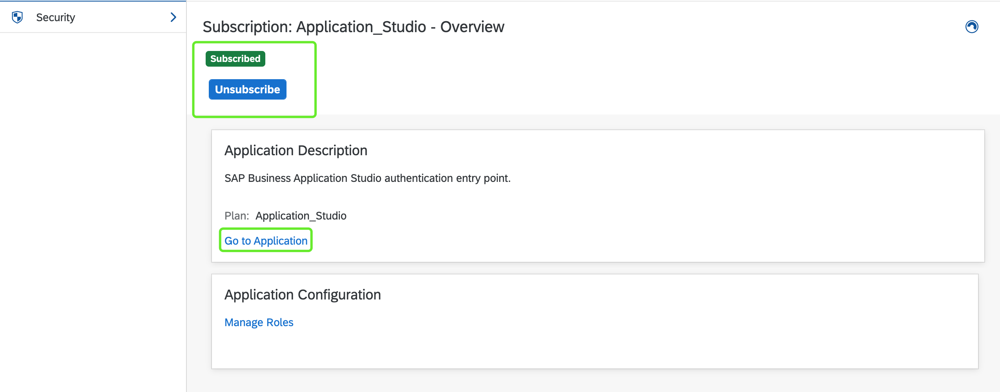

### 配置SAP Business Application Studio访问权限

成功订阅应用之后，您只需要配置其访问权限即可开始使用SBAS。

:point_right: 回退到子账户面板，在左侧条目中找到`Security`，在展开的下拉条目中，点击`Role Collections`进入权限配置页面。

:point_right: 点击右侧`+`按钮，在弹出的对话框中输入权限集合名称，任意名称均可。

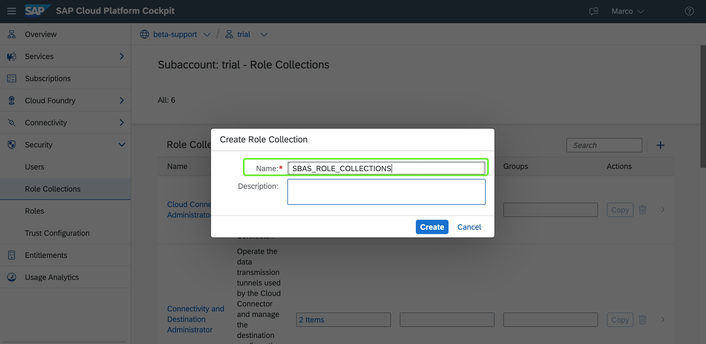

:point_right: 找到新创建的权限集合，点击按钮`>`进入配置权限详细页面。

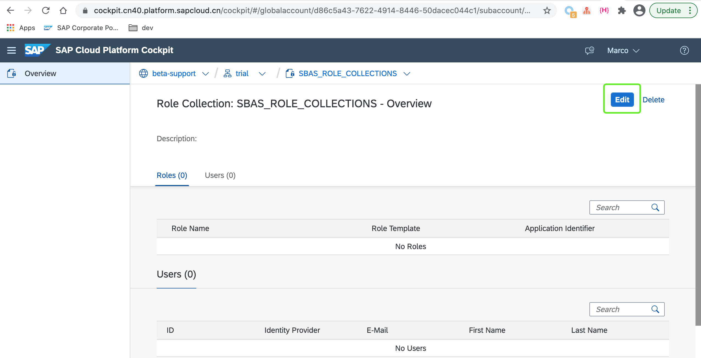

:point_right: 点击`Edit`按钮，在用户栏目中输入您的邮箱账户，选中弹出的用户信息条目，以指定该用户为即将添加的权限所有者。

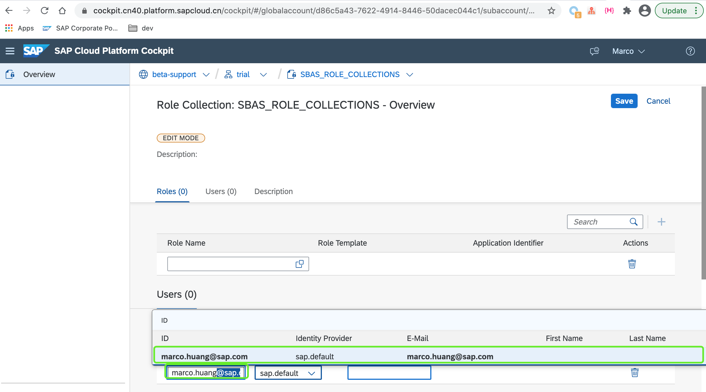

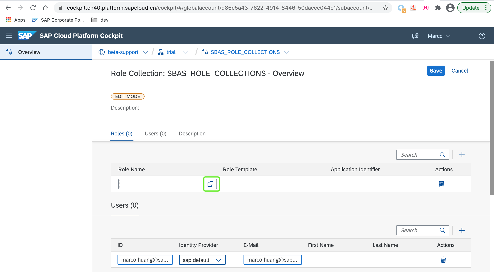

:point_right: 在角色栏中，点击列表按钮，在弹出的可选权限列表中您将会看到所有可选的权限。分别选中名称为`Business_Application_Studio_Administrator`，`Business_Application_Studio_Developer`的`Role Template`，点击`Add`按钮添加与SBAS相关的权限。

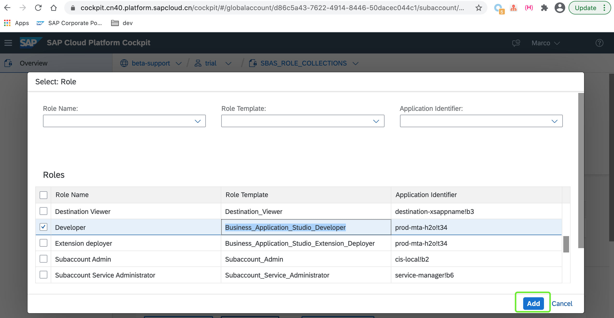

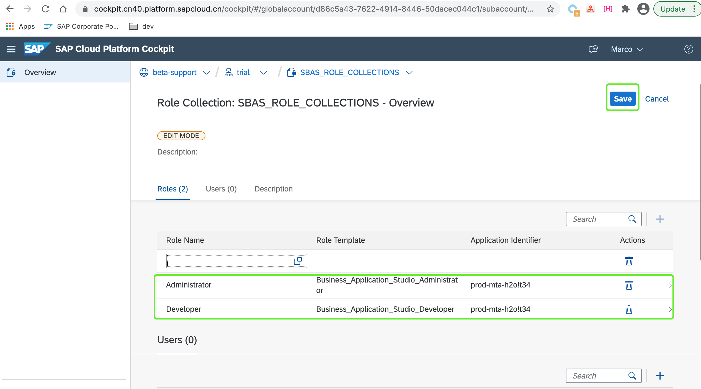

点击`Save`按钮保存所作的修改。

至此您已完成SBAS相关权限的添加。

### 进入SBAS

我们已完成对于SBAS的订阅以及相关权限的配置，现在在云平台主控室首页中点击`Subscription`，进入订阅中心。

:point_right: 找到`SAP Business Application Studio`订阅条目，点击链接`Go to Application`弹出新网页进入SBAS应用主页。

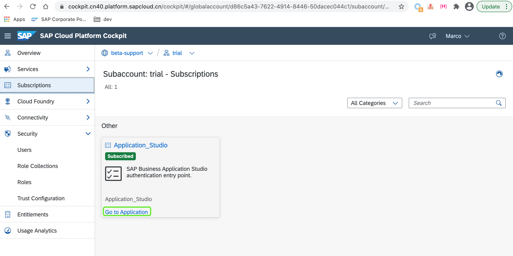

在弹出的用户名密码登录界面中，输入您的邮箱账户和密码即可登录到SBAS。

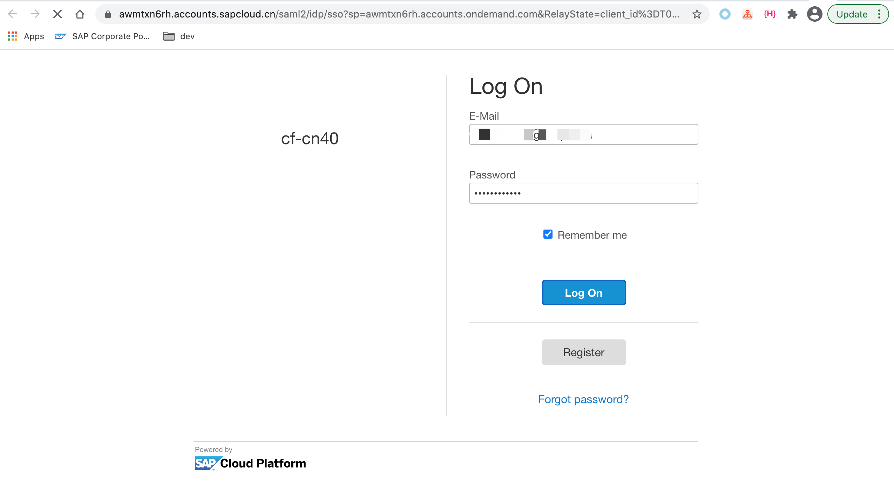

:point_right: 请留意`Create Dev Space`按钮，我们在接下来的章节中将会点击该按钮创建新的工作区间。

至此，您已完成SBAS的权限配置等相关准备工作，您可点击[02-配置SBAS开发环境](https://github.com/HuangMarco/teched-2020-sap-cap/blob/master/exercises/02/README.md)进入下一章节练习。
