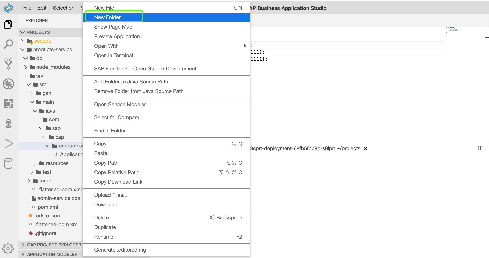
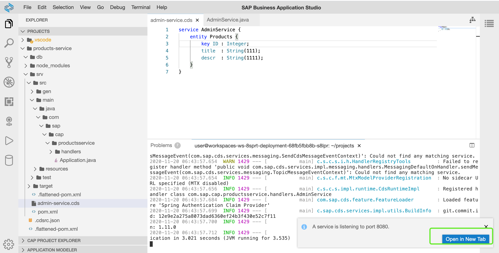
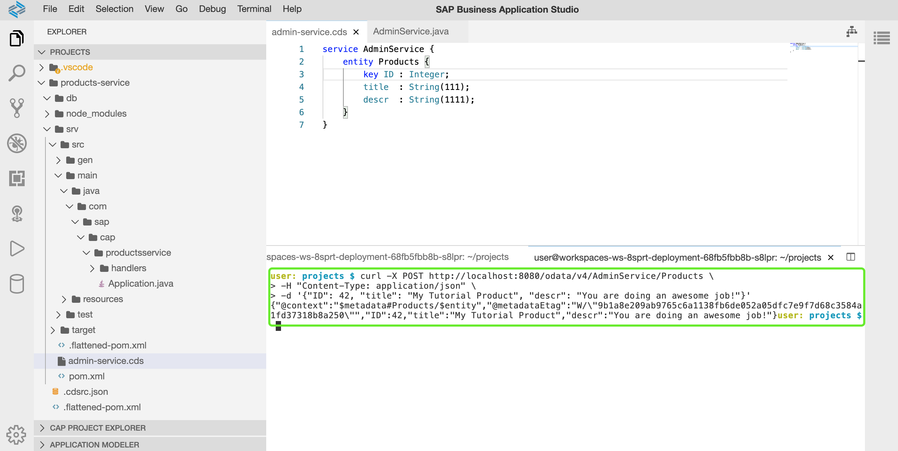

# 05-添加自定义业务逻辑

在上一章节中，我们已完成：

- 创建CAP CDS Service
- 创建实体对象
- 暴露CAP应用并通过浏览器访问实体元数据对象
- 访问实体数据

## 章节目标

在本章节中，您将完成以下内容：

- 添加CAP event，实现针对于Products实体的增加和读取功能

## 添加Event Handler

:point_right: 在`srv/src/main/java/com/sap/cap/productsservice`目录下，创建新的文件夹名为**handlers**,用于存放自定义的event handler。在这里创建文件夹相当于创建一个新的package。



:point_right: 在新的handlers包下创建名称为`AdminService.java`的Java类，代码如下：

```java
 package com.sap.cap.productsservice.handlers;

 import java.util.HashMap;
 import java.util.Map;

 import org.springframework.stereotype.Component;

 import com.sap.cds.services.cds.CdsCreateEventContext;
 import com.sap.cds.services.cds.CdsReadEventContext;
 import com.sap.cds.services.cds.CdsService;
 import com.sap.cds.services.handler.EventHandler;
 import com.sap.cds.services.handler.annotations.On;
 import com.sap.cds.services.handler.annotations.ServiceName;

 @Component
 @ServiceName("AdminService")
 public class AdminService implements EventHandler {

     private Map<Object, Map<String, Object>> products = new HashMap<>();

     @On(event = CdsService.EVENT_CREATE, entity = "AdminService.Products")
     public void onCreate(CdsCreateEventContext context) {
         context.getCqn().entries().forEach(e -> products.put(e.get("ID"), e));
         context.setResult(context.getCqn().entries());
     }

     @On(event = CdsService.EVENT_READ, entity = "AdminService.Products")
     public void onRead(CdsReadEventContext context) {
         context.setResult(products.values());
     }

 }
```

## 关于Event Handler - AdminService

针对于目标实体对象Products, 我们在新增的Event Handler中：

- [自定义Event Handler](https://cap.cloud.sap/docs/java/srv-impl#event-handler-classes)需要实现`EventHandler`接口，同时需要将自身注入到Spring上下文中成为一个Spring管理的bean，通过该接口，CAP Runtime即可识别在Spring的bean中哪些是与CAP相关的
- [Event Handler Methods](https://cap.cloud.sap/docs/java/srv-impl#event-handler-methods)包含`@On`, `@Before`. `@After`三种注解，每种事件都可以自由与此三种annotation匹配
- 每个Event Handler Method接受一个对应的`Cds***EventContext`类型入参。`Cds***EventContext`类型基于事件上下文，其提供访问对应事件中的传递过来的参数，同时该参数可以设置事件处理之后的返回结果。以`CdsCreateEventContext context`为例，其继承于事件`CREATE`。
- `@ServiceName`表明定义的事件将应用于`AdminService`上，同时`AdminService`也是CDS文件`admin-service.cds`中定义的service名称
- 新增了针对于**读**的事件，在读事件中，我们将所有内存中的Products实体数据塞入到上下文中
- 新增了针对于**增**的事件，在增事件中，我们将满足条件的Products实体数据写入到内存上下文中

[CAP CQN](https://cap.cloud.sap/docs/cds/cqn)专用于查询CDS Service，

## 重新发布应用

在之前已开启的终端命令行中，通过`CTRL + C`强行停止已运行的应用。

:point_right: 输入以下命令重新运行应用：

```sh
cd ~/projects/products-service && mvn clean spring-boot:run
```



:point_right: 在右下角弹出的窗口中，点击`Open in New Tab`开启新浏览器标签以访问CAP应用

## 访问CAP应用并插入数据

通过上面的步骤，我们添加了自定义Event Handler同时重启了CAP应用，现在我们再次访问CAP应用，并尝试向其插入数据。

:point_right: 回到SBAS浏览器页面，在SBAS中新建一个新的终端命令行,同时保持之前的终端命令行**不关闭**。

在新的终端命令行中执行以下命令尝试插入一条新的数据：

```sh
curl -X POST http://localhost:8080/odata/v4/AdminService/Products \
-H "Content-Type: application/json" \
-d '{"ID": 42, "title": "My Tutorial Product", "descr": "You are doing an awesome job!"}'
```



:point_right: 再次切换到访问CAP应用的浏览器页面，点击`Products`链接，查看其实体数据。


:point_right: 可多次尝试刷新浏览器，查看刷新之后数据是否依然存在。您也可以尝试通过Postman或IDEA HTTP Client等工具来访问SBAS中运行的CAP应用。

至此，我们已完成创建自定义的Event Handler，通过自定义的Event Handler我们实现了将Products实体数据写入至内存，以及从内存中读取Products数据的功能。但是将CDS实体与CDS Service放置在一起，依然不是一个最佳选择，同时也不符合通常的项目规范。接下来，您将进入到下一章节[06-新建持久层以及重用CDS通用特性](https://github.com/HuangMarco/teched-2020-sap-cap/blob/master/exercises/06/README.md)。